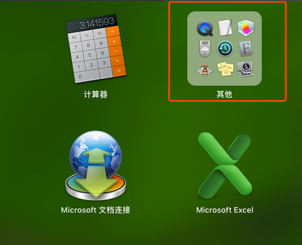

# 极简人工智能


人工智能其实比较笼统，我们现在都是说机器学习、深度学习之类，但是为了初学者可以了解我尽量用最通俗的语言，尽可能减少术语。


我以前是京东的架构师，职级T8。现在中国科学院大学读研，经济与管理管理学院，特色人工智能与应用班。


之前有过非常多的带新人经历，现在斗胆也来试试看用最简单的方式让大家学会人工智能


[已经入门的请看目录](index.md)


# 入门


## 思维


首先，有个人工智能的思维。


通俗的讲，就是拿出一些已经有结果的数据交给计算机，计算机分析出关联性，然后对新的数据做预测


## 准备


+ Python3.x
+ sklearning库


## 编码


如果遇到问题请去下面的Q&A或者给我留言


我们找一个已经彻底确定的事情来做测试


比如打骰子比大小，打两个


一个1，一个2，那么是小


一个5，一个6，那么是大


```python
# dice.py
from sklearn.svm import SVC

X_train = [# 训练集，输入参数，注意这里的X是大写
  [1,2],
  [5,6]
]
y_train = [0, 1] # y值，结果

ai = SVC() # 定义一个人工智能模型
ai.fit(X_train, y_train) # 让人工智能通过参数和结果找关系

test = [ # 测试
  [1,1],
  [2,3],
  [3,3],
  [2,5],
  [4,3],
  [6,6]
]
res = ai.predict(test) # 预测测试结果
print(res)
```


执行之后看到结果为


```
[0 0 0 1 1 1]
```


机器已经学会了判断大小并且正确预测了


## Q&A


如果没有安装 **python** ，先去下载和安装 https://www.python.org/downloads/


如果没有 **sklearn** 库请用 **pip** 安装


```bash
pip install -U scikit-learn
```

不懂什么叫 **pip** ？


> 无所谓，复制上面的代码在 **终端** 里执行


不懂什么叫 **终端** ？


> 如果用的windows，请用cmd。如果win10找不到开始了？请用win+r
>
>
> 
>
>
> 
>
>
> 如果用的mac
>
>
> 
>
>
> 